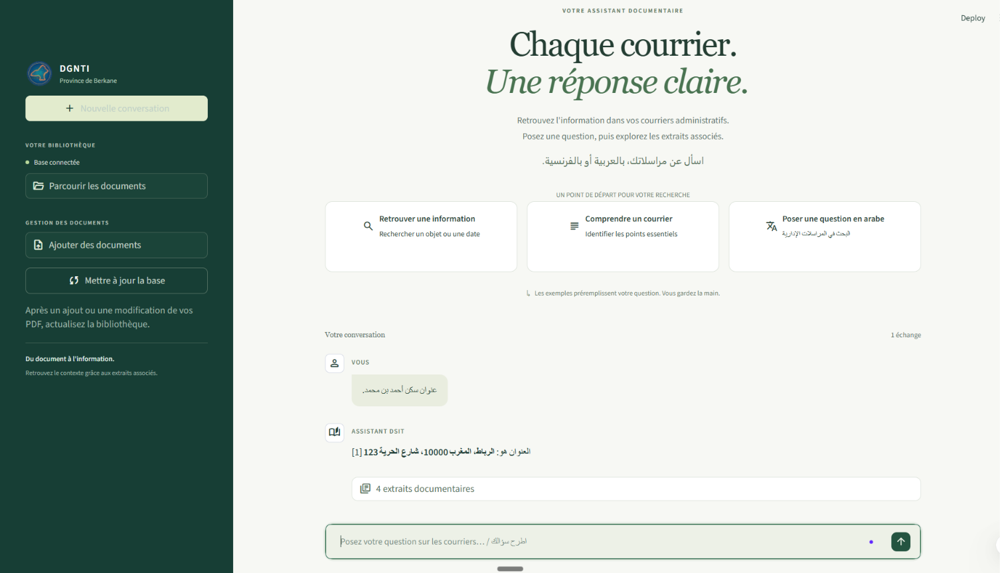
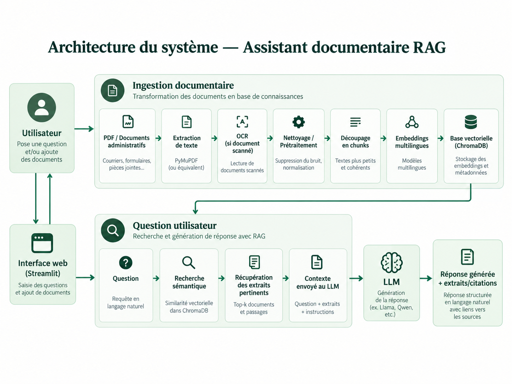

# RAG Assistant DGNTI

**Interroger des PDF français et arabes et consulter les extraits associés aux réponses.**

[English](README.md) | Français

Assistant documentaire Python combinant extraction locale des PDF, OCR bilingue, recherche sémantique et génération via Groq. L'interface Streamlit prend en charge les courriers administratifs français et arabes.

## Interface

<p align="center">
  
</p>

## Fonctionnalités

- Extraction directe du texte et OCR Tesseract pour les pages scannées ou illisibles.
- Découpage en passages avec chevauchement et conservation du fichier et du numéro de page.
- Recherche par le sens avec les embeddings multilingues E5 et Chroma.
- Réponses avec références numérotées aux extraits et suivi de conversation.
- Détection des PDF ajoutés, modifiés et supprimés lors des mises à jour.
- Construction et vérification d'une nouvelle collection avant activation pour conserver la précédente en cas d'échec.

## Architecture

<p align="center">
  
</p>

L'OCR et les embeddings sont calculés localement. Groq reçoit la question, les échanges récents et les extraits sélectionnés. L'application utilise la génération augmentée par recherche ; elle n'entraîne pas de modèle sur les PDF.

## Technologies

| Composant | Technologie |
| --- | --- |
| Interface | Streamlit |
| PDF et OCR | PyMuPDF, Tesseract, Pillow |
| Embeddings | `intfloat/multilingual-e5-base`, Sentence Transformers |
| Base vectorielle | Chroma |
| Génération | Groq via LangChain |

## Lancement sous Windows

Installer Python 3.11 ou supérieur et Tesseract avec les langues française (`fra`) et arabe (`ara`). Depuis le dossier du projet :

```powershell
python -m venv venv
.\venv\Scripts\python.exe -m pip install -r requirements.txt
```

Créer `.env` à partir de `.env.example` s'il n'existe pas, puis renseigner `GROQ_API_KEY`. Configurer `TESSERACT_CMD` si nécessaire. `GROQ_MODEL` choisit le modèle de réponse ; la valeur configurée par défaut est `openai/gpt-oss-120b`. Son accès dépend du compte Groq.

Créer `pdfs/`, y placer des documents que vous êtes autorisé à traiter, puis lancer :

```powershell
.\venv\Scripts\python.exe -m streamlit run app.py
```

Cliquer sur **Mettre à jour la base**, puis poser une question en français ou en arabe. Le modèle d'embedding est téléchargé au premier usage ; la génération nécessite Internet. Aucun PDF d'exemple n'est fourni.

Synchronisation depuis le terminal :

```powershell
.\venv\Scripts\python.exe ingest.py
.\venv\Scripts\python.exe ingest.py --rebuild
```

`--rebuild` refait l'extraction et l'OCR. La synchronisation normale réutilise les passages inchangés mais recalcule les embeddings lors de la création d'une nouvelle génération.

## Organisation du code

| Chemin | Rôle |
| --- | --- |
| `app.py` | Point d'entrée et parcours de question |
| `config.py` | Modèles, chemins, limites et prompt bilingue |
| `ingest.py` | Commande de synchronisation |
| `rag/pdf_loader.py` | Extraction PDF, OCR et découpage |
| `rag/vectorstore.py` | Embeddings et index persistant |
| `rag/qa_engine.py` | Recherche, contexte et génération |
| `ui/chat.py` | Accueil, messages et sources |
| `ui/sidebar.py` | Documents et mise à jour |
| `ui/styles.py` | Style personnalisé |
| `.streamlit/config.toml` | Thème Streamlit |
| `.env.example` | Configuration sans secrets |

## Comportement de l'index et limites

- Les empreintes SHA-256 détectent les changements. Les anciennes collections restent sur disque ; utiliser un seul processus d'indexation à la fois.
- Un dossier manquant, un fichier illisible ou une erreur OCR interrompt la mise à jour. Les pages au texte insuffisant sont ignorées ; un PDF sans texte exploitable bloque la publication.
- Un dossier PDF vide peut publier une collection vide si une base existe déjà. La mise à jour efface la conversation de la session courante.
- Les collections historiques sans manifeste supposent que le modèle configuré correspond au modèle initial. Une mise à jour explicite les migre vers les embeddings E5 normalisés avec préfixes `query:` et `passage:`.
- La qualité OCR et des réponses reste à évaluer sur des exemples annotés. Les citations identifient les extraits fournis sans vérifier chaque affirmation. Le seuil de pertinence est désactivé en attendant son calibrage.

## Données

`.gitignore` exclut `.env`, les PDF locaux, la base Chroma et les environnements. Ne pas ajouter de secrets ou de documents confidentiels aux commits. Utiliser uniquement des documents dont le partage avec le service de génération est autorisé.

## Langue de développement

La documentation existe en anglais et en français ; l'interface reste française/arabe. Les identifiants Python existants suivent la convention française du projet. Employer des noms et commentaires anglais cohérents pour les nouveaux modules, en conservant les langues de l'interface pour les textes affichés.
