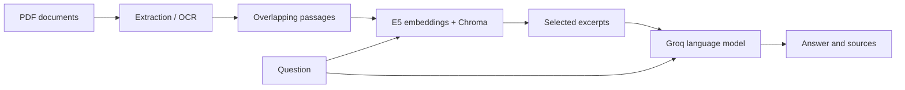

# RAG Assistant DGNTI

**Ask questions about French and Arabic PDFs and inspect the supporting excerpts.**

English | [Français](README.fr.md)

A Python document assistant combining local PDF extraction, bilingual OCR, semantic search and answer generation through Groq. The Streamlit interface supports French and Arabic administrative correspondence.

## Interface

<p align="center">
  
</p>

## Features

- Extract text from PDFs; use Tesseract OCR for scanned or unreadable pages.
- Split text into overlapping passages while preserving file names and page numbers.
- Search by meaning with multilingual E5 embeddings and Chroma.
- Generate answers with numbered excerpt references and follow-up conversation context.
- Detect added, changed and removed PDFs during synchronization.
- Build and validate a new index collection before activating it, preserving the previous generation if an update fails.

## Architecture



OCR and embeddings run locally. Groq receives the question, recent conversation and selected excerpts. This is retrieval-augmented generation, not training a model on the PDFs.

## Stack

| Component | Technology |
| --- | --- |
| Interface | Streamlit |
| PDF and OCR | PyMuPDF, Tesseract, Pillow |
| Embeddings | `intfloat/multilingual-e5-base`, Sentence Transformers |
| Vector database | Chroma |
| Answer generation | Groq via LangChain |

## Run on Windows

Install Python 3.11 or later and Tesseract with French (`fra`) and Arabic (`ara`) language data. From the project directory:

```powershell
python -m venv venv
.\venv\Scripts\python.exe -m pip install -r requirements.txt
```

Create `.env` from `.env.example` if it does not already exist and set `GROQ_API_KEY`. Set `TESSERACT_CMD` if needed. `GROQ_MODEL` selects the answer model; the configured default is `openai/gpt-oss-120b`. Model access depends on your Groq account.

Create `pdfs/`, add PDFs you are authorized to process, then run:

```powershell
.\venv\Scripts\python.exe -m streamlit run app.py
```

Click **Mettre à jour la base**, then ask a question in French or Arabic. The embedding model downloads on first use; answer generation requires Internet access. No sample PDFs are bundled.

To synchronize from the terminal:

```powershell
.\venv\Scripts\python.exe ingest.py
.\venv\Scripts\python.exe ingest.py --rebuild
```

`--rebuild` repeats extraction and OCR. Normal updates reuse unchanged passages, but recalculate embeddings when building a new generation.

## Project structure

| Path | Purpose |
| --- | --- |
| `app.py` | Application entry point and question workflow |
| `config.py` | Models, paths, limits and bilingual prompt |
| `ingest.py` | Index synchronization command |
| `rag/pdf_loader.py` | PDF extraction, OCR and splitting |
| `rag/vectorstore.py` | Embeddings and persistent index management |
| `rag/qa_engine.py` | Retrieval, conversation context and generation |
| `ui/chat.py` | Welcome screen, messages and sources |
| `ui/sidebar.py` | Document list and update controls |
| `ui/styles.py` | Custom styling |
| `.streamlit/config.toml` | Streamlit theme |
| `.env.example` | Configuration template without credentials |

## Index behavior and limitations

- SHA-256 fingerprints detect document changes. Old collections remain on disk; use only one indexing process at a time.
- Missing folders, unreadable files and OCR errors interrupt updates. Pages with insufficient text are skipped; a PDF with no usable text blocks publication.
- Synchronizing an empty PDF folder can publish an empty collection when a database already exists. Updating clears the current session's conversation.
- Legacy collections without a manifest assume the configured embedding model matches their original model. An explicit update migrates them to normalized E5 embeddings with `query:` and `passage:` prefixes.
- OCR and answer quality still need evaluation on annotated examples. Citations identify supplied excerpts; they do not automatically verify each statement. The relevance threshold is disabled until calibrated.

## Data handling

`.gitignore` excludes `.env`, local PDFs, the Chroma database and environment folders. Keep credentials and confidential documents out of commits. Process only documents you are authorized to share with the configured answer service.

## Development language

Documentation is available in English and French; the interface remains French/Arabic. Existing Python identifiers follow the project's French naming. Use consistent English names and comments for new modules while keeping user-facing text in the interface languages.
